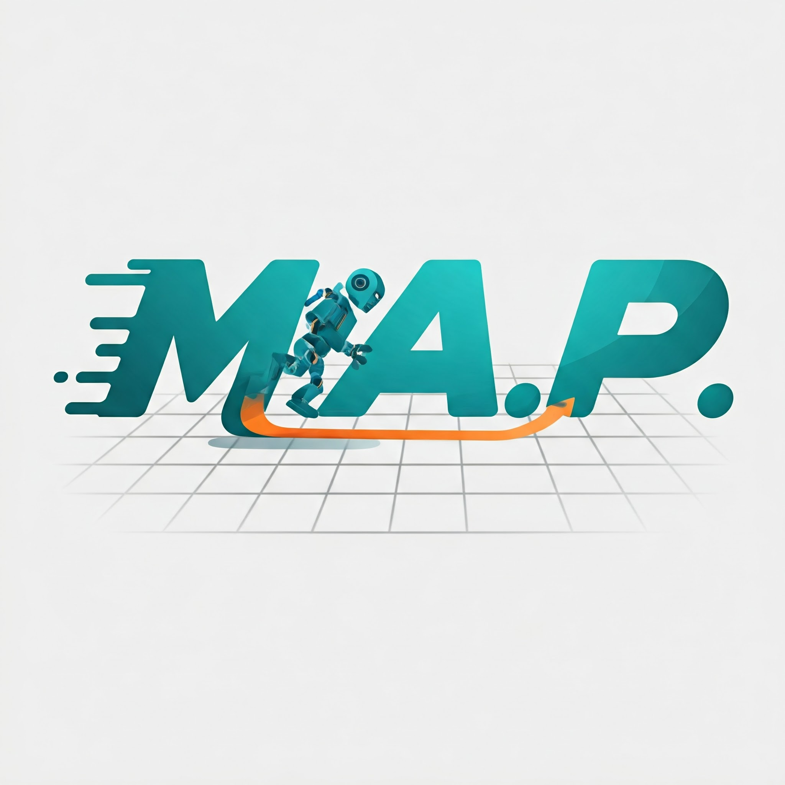

#   Motion Analysis Platform (M.A.P.)

<br>

[](https://www.python.org/)
[](https://www.pygame.org/)
[](https://opensource.org/licenses/MIT)

> [!NOTE]
>  The project is currently Under Developement so the below README may not provide whole information Yet.*
> 
## Welcome to the Future of Motion Planning!

**M.A.P.** isn't just another motion planning framework; it's your interactive playground for exploring the fascinating world of robotics algorithms!  Dive deep into 2D environments, design challenging scenarios, and unleash the power of pathfinding with a user interface so intuitive, it feels like magic.

[//]: # (<p align="center">)

[//]: # (  )

[//]: # (  )

[//]: # (</p>)

## Why M.A.P.? Because We've Got It All:

*   **⚡️ <ins>Visualize the Magic</ins>:** Witness algorithms come to life with real-time visualization! Watch as your chosen pathfinders navigate complex mazes, dance around obstacles, and race towards their goals.
*   **🤖 <ins>Become the Algorithm Architect</ins>:** Unleash your inner genius! Import and test your own custom motion planning algorithms with ease. M.A.P.'s flexible design welcomes innovation.
*   **🕵️‍♀️ <ins>Sensors Galore</ins>:**  Don't limit your robots! Equip them with custom-designed sensors through a seamless import system. The world is your oyster (or at least, your 2D grid).
*   **🎓 <ins>Learn by Doing</ins>:** M.A.P. is more than just a tool; it's an educational adventure. Perfect for students, researchers, and anyone curious about the captivating realm of robotics.
*   **🎨 <ins>Effortless Environment Design</ins>:** Craft intricate worlds with a user-friendly environment editor. Save, load, and modify your creations with simple clicks and keystrokes. No more tedious coding of grids!
*   **🚀 <ins>Ready, Set, Execute!</ins>:** Select your algorithm, set your start and goal, and hit "Run"! M.A.P.'s dedicated execution screen puts you in the control room of your robotic simulations.

## Feature Frenzy:

| Feature                  | Description                                                                                                                                               |
| :----------------------- | :-------------------------------------------------------------------------------------------------------------------------------------------------------- |
| **Environment Editor**   | Design custom 2D environments with obstacles. Save and load your creations.                                                                                |
| **Algorithm Selection** | Choose from pre-built algorithms (Bug, Potential Field, more to come!) or import your own.                                                                  |
| **Sensor Import**        | Integrate custom sensor models (must inherit from `SensorModel`) to enhance your robots' perception.                                                     |
| **Execution Screen**     | Set start/goal positions, run algorithms, and visualize the pathfinding process.                                                                           |
| **Real-time Visualization** | Watch algorithms in action as they explore the environment and discover paths.                                                                             |
| **User-Friendly UI**     | Intuitive Pygame-based interface for a smooth and engaging experience.                                                                                    |
| **Modular Design**       | Easily extendable architecture. Add new algorithms, sensors, and features with a well-defined structure.                                                  |
| **Cross-Platform**       | Runs wherever Python and Pygame go! (Windows, macOS, Linux)                                                                                                  |
| **Open Source (MIT)**    | Contribute, modify, and share! Let's build the future of motion planning together.                                                                        |

## Installation - Let's Get This Party Started:

1. **Clone the Repository:**

    ```bash
    git clone https://github.com/yourusername/motion_analysis_platform.git
    cd motion_analysis_platform
    ```

2. **Install the Dependencies:**

    ```bash
    pip install -r requirements.txt
    ```

## Usage - Unleash Your Inner Robot Master:

1. **Launch the Main Menu:**

    ```bash
    python examples/basic_ui_usage.py
    ```

2. **Explore the UI:**
    *   **Edit Environment:** Create your own 2D world!
    *   **Import Sensor Model:** Give your robots the gift of sight (or other senses).
    *   **Select Algorithm:** Choose your pathfinding champion.
    *   **Start!:** set the start and goal and watch the algorithm work its magic.

## Documentation - Your Guide to the Galaxy:

Detailed documentation, including a comprehensive API reference 
and tutorials,
will be in the `docs/` directory. 

[//]: # (Build it yourself with Sphinx:)

[//]: # (```bash)

[//]: # (cd docs/)

[//]: # (make html)

[//]: # (```)

[//]: # (Then, open `_build/html/index.html` in your browser.)

## Contributing - Join the Movement:

I wholeheartedly welcome contributions! Whether you're a seasoned developer or a curious newcomer, your ideas and enhancements are valuable. Check out the `CONTRIBUTING.md` file for guidelines.

## License - Sharing is Caring:

M.A.P. is released under the **MIT License**. Feel free to use, modify, and distribute it as you see fit.

## Acknowledgements - MAP Stand on the Shoulders of Giants:

*   **Pygame:**  The amazing library that powers our UI.
*   **Python:** The versatile language that makes it all possible.
*   **All the brilliant minds** who have contributed to the field of motion planning.

## The Future is Bright - And Full of Robots:

M.A.P. is under active development. I envision a future where this platform becomes a vibrant hub for motion planning research, education, and experimentation.

**Stay tuned for:**

*   More pre-built algorithms (RRT, PRM, and beyond!).
*   Advanced sensor models.
*   3D environments (because why not?).
*   AI-powered features.
*   A thriving community of users and contributors.

## Let's build something amazing together!

<p align="center">
  
</p>

---
